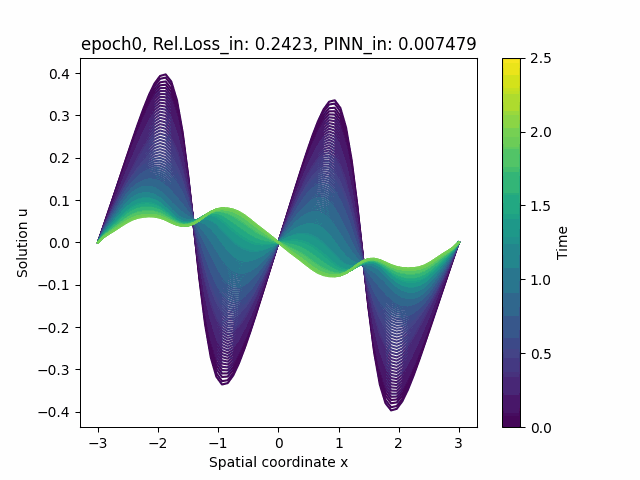

Another area of my research focuses on using coordinate-based neural networks for data-driven and physics-informed learning to approximate solutions of spatio-temporal governing PDEs. This work involves modeling latent state dynamics to solve parametric PDEs, contributing to the field of Physics Informed Neural Networks (PINNs) for reduced-order modeling.

### CNF-ROM Structure
- **Objective**: Learn coordinate-based NN to approximate parameterized PDE solution.
- The approach combines a parametric neural ODE (PNODE, Lee and Parish 2021), which models latent dynamics, with a decoder that reconstructs PDE solutions. 
- The decoder maps the latent state and coordinates to the solution (Yin et al., 2023), while the PNODE captures distinct latent trajectories for each parameter.

### PINNs Objective
- PDE residual loss is available for CNF-ROM. 
- The CNF-ROM leverages coordinate-based neural networks to directly compute spatial derivatives via automatic differentiation. 
- Temporal dynamics, on the other hand, are modeled through a latent state $\alpha_{t,\mu}$ that evolves over time for each $\mu$. Using the chain rule, temporal derivatives are expressed as: 

$$
\frac{\partial D_{\mathbf{z}}}{\partial t} = \frac{\partial \mathbf{x}}{\partial t} \frac{\partial D_{\mathbf{z}}}{\partial \mathbf{x}} + f_{\mathbf{x}} (\mathbf{x}, \mu, t)
$$

- Instead of incorporating IC and BC as loss terms, we address strategies for imposing exact IC and BC and discuss the trade-offs in this approach in the following paragraphs.

---

### Trade-offs in Imposing Exact IC/BC

1. Limitation of Physics-informed Neural Networks (PINNs)
- Initial and boundary conditions (IC, BC) are not strictly met when added as loss terms.
- Introduced: **Approximate distance function** to impose hard constraints.

2. Limitation of R-function-based Approximate Distance Function (ADF, $\phi$, Sukumar and Srivastava 2022)
- The second and higher-order derivatives of $\phi$ explode at the joining points or boundaries.
- Introduced an auxiliary CNF-ROM to learn the first derivatives of the model ouput to replace second or higher-order derivatives with the derivatives of the auxiliary network.

---

### References

- M. Kim, T. Wen, K. Lee, Y. Choi, (2024), [Physics-informed reduced order model with conditional neural fields](../assets/documents/manuscript24-CNF-ROM.pdf), *NeurIPS 2024 Workshop on Machine Learning and the Physical Sciences*, (to appear).

- K. Lee and E. J. Parish, (2021), Parameterized neural ordinary differential equations: applications to computational physics problems, *Proceedings of the Royal Society A*, 477(2251):20210162.

- Y. Yin, M. Kirchmeyer, J. Franceschi, A. Rakotomamonjy, and P. Gallinari, (2023), Continuous PDE dynamics forecasting with implicit neural representations, *In The Eleventh International Conference on Learning Representations*.

-  N. Sukumar and A. Srivastava, (2022), Exact imposition of boundary conditions with distance functions in physics-informed deep neural networks, *Computer Methods in Applied Mechanics and Engineering*, 389:114333.