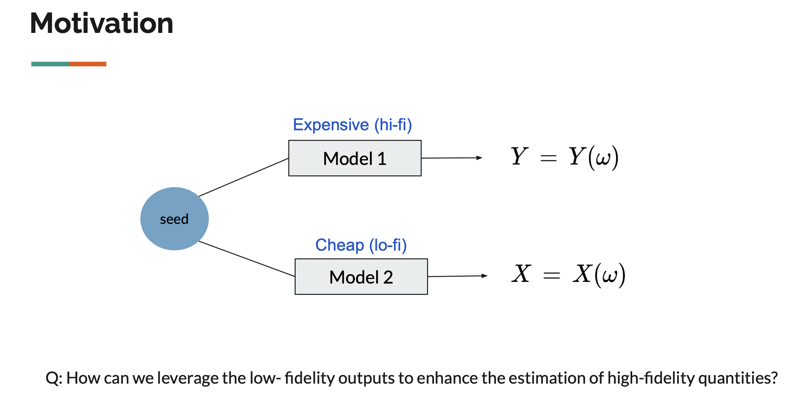

My research focuses on leveraging multiple computer models with varying levels of fidelity (in terms of accuracy and cost) to achieve more accurate estimations, a field known as multi-fidelity (MF) modeling.

**Motivation:** Naval ship motion application (and especially their extremes) 

**Goal:** Development of theoretically rigorous statistical methodologies

The ultimate goal of this research is to achieve **probability density estimation** of high-fidelity (expensive) outputs by effectively leveraging (cheap) surrogate model outputs. The research explores methods to address this challenge through:

1. Nonparametric kernel density estimation with importance sampling (Kim (2024a)).
2. Parametric ensemble estimator approach (Kim (2024b)).

The field includes semi-supervised learning problems, where we are given partially labeled data
$$(X_1,Y_1), \dots (X_n,Y_n), X_{n+1}, \dots, X_{n+m}, $$ as low-fidelity data ($X$) is more accessible than high-fidelity data ($Y$).
According to Peherstorfer et al. (2018), MF strategies can be categorized into three types as follows:

1. **Adaptation**: High-fidelity information is used to enhance the lower-fidelity model.
2. **Filtering**: The low-fidelity model is explored to determine where to evaluate the high-fidelity model.
3. **Fusion**: This involves the combined use of multiple models.

### My Contributions

The application of our interest concerns modeling ship motions (and especially their extremes) in the field of Naval Architecture. I have conducted a series of studies in this area, and my research can be categorized as follows:

- **MF Calibration**: Kim (2023) of adaptation type focused on improving the low-fidelity output by leveraging high-fidelity output.
- **MF Importance Sampling**: Kim (2024a) tackled the problem of estimating the probability density function (p.d.f) of high-fidelity values based on a kernel-based importance sampling estimator, a problem that combines filtering and fusion strategies.
- **MFMC**: Kim (2024b) research proposed an ensemble approach for parameter estimation in parametric distributions for multi-fidelity outputs. We propose and compare fusion-type multi-fidelity Monte Carlo estimators.

I also presented parts of this research during the **Graduate Student Seminar at UNC Chapel Hill** and my dissertaion proposal. You can find the slides [here](../assets/documents/talk25-proposal.pdf).

For more details, please refer to the corresponding publications.

### References

- Peherstorfer, B., Willcox, K., and Gunzburger, M, (2018), ‘Survey of multifidelity methods in uncertainty propagation, inference, and optimization’. *SIAM Review*, 60(3), 550–591.

- M. Kim, V. Pipiras, A. Reed, K. Weems, (2023), Calibration of low-fidelity ship motion programs through regressions of high-fidelity forces, *Ocean Engineering*, 290, 116321

- M. Kim, K. O’Connor, V. Pipiras, T. Sapsis, (2024a), Sampling low-fidelity outputs for estimation of high-fidelity density and its tails, *SIAM/ASA Journal on Uncertainty Quantification*, to appear

- M. Kim, B. Brown, V. Pipiras, (2024b), Parametric multi-fidelity Monte Carlo estimation with applications to extremes, Preprint.

