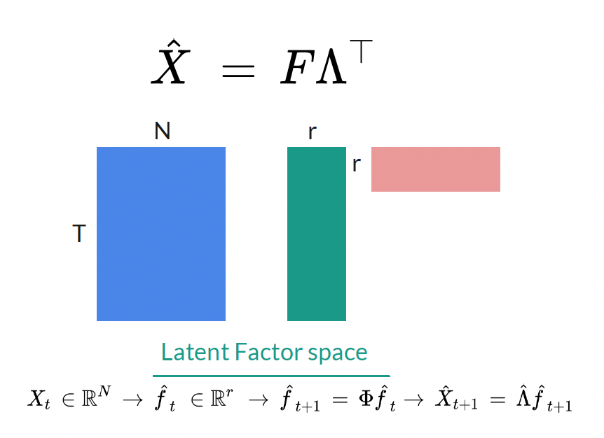
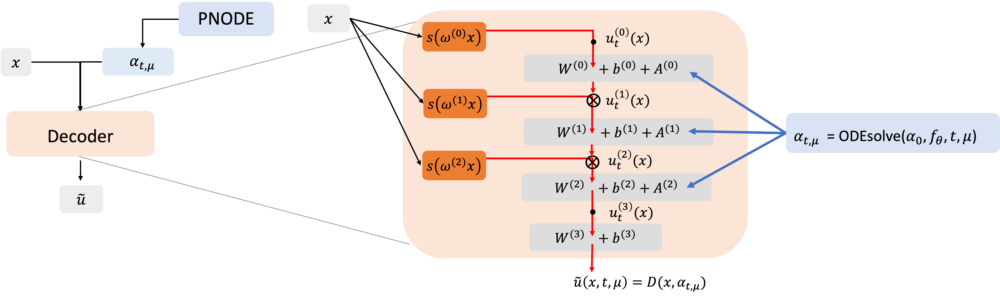

## 1. Statistical methods for uncertainty quantification in Multi-Fidelity systems (2022-)

**Motivation:** Naval ship motion application (and especially their extremes) 

**Goal:** Development of theoretically rigorous statistical methodologies

The ultimate goal of this research is to achieve **probability density estimation** of high-fidelity (expensive) outputs by effectively leveraging (cheap) surrogate model outputs. The research explores methods to address this challenge through:

1. Nonparametric kernel density estimation with importance sampling (Kim (2024a)).
2. Parametric ensemble estimator approach (Kim (2024b)).

This field includes semi-supervised learning problems, where partially labeled data:
$$(X_1,Y_1), \dots (X_n,Y_n), X_{n+1}, \dots, X_{n+m},$$
are used as low-fidelity data ($X$) is more accessible than high-fidelity data ($Y$). According to Peherstorfer et al. (2018), multi-fidelity (MF) strategies can be categorized as:

1. **Adaptation:** High-fidelity information is used to enhance the lower-fidelity model. 
 - Kim (2023) of adaptation type focused on improving the low-fidelity output by leveraging high-fidelity output.
2. **Filtering:** The low-fidelity model is explored to determine where to evaluate the high-fidelity model. 
 - Kim (2024a) tackled the problem of estimating the probability density function (p.d.f) of high-fidelity values based on a kernel-based importance sampling estimator, combining filtering and fusion strategies.
3. **Fusion:** This involves the combined use of multiple models.
 - Kim (2024b) proposed an ensemble approach by reformulating the distribution estimation problem into a parameter estimation of parametrized distribution, compared and analyzed the uncertainty reduction of fusion-type multi-fidelity Monte Carlo estimators.

Parts of this research were presented during the **Graduate Student Seminar at UNC Chapel Hill** and my dissertaion proposal. Slides summarizing my research are available here: [here](../assets/documents/talk25-proposal.pdf).

**Tools:** Simulations conducted using **R**.

## 2. Spatio-Temporal Modeling in Latent Space

### 2-1. Spatio-temporal analisys of particulate matter data (2020–2021)

**Motivation:** Particulate matter data in Seoul

**Goal:** Forecasting, missing data imputation, and quantile analysis

During my master’s studies, I analyzed particulate matter data using a **dynamic factor model** and the **EM algorithm**. 

**Structure:**

- Latent state projection via **linear projection**
- Latent dynamics modeled using time-series vector auto-regressive  **(VAR)** model

  

Although I achieved the strong performance in prediction (interpolation) and missing data imputation, I recognized a key limitation: models trained solely on data inevitably regressed toward average predictions in extrapolation scenarios. 
This motivated me to focus on integrating governing physics into data-driven models during my doctoral studies to enhance performance, interpretability, and real-world relevance.

Part of this research was presented at the Conference on Statistical Practice 2021. [Poster available here](../assets/documents/poster21-csp.pdf).

### 2-2. Physics-Informed Neural Networks (2024 -)

**Motivation:** Solve spatio-temporal parametrized partial differential equations (PDEs).

**Goal:** Introducing a physics-informed learning objective to the latent state modeling structure

Gaining hands-on experience on data-driven physics simulation during my first year PhD summer internship, I shifted towards using **physics-informed neural networks (PINNs)**. We present CNF-ROM structure (which uses neural networks for latent space modeling) and its physics-informed learning objective.

**Structure:**

- Latent state projection via **decoder-only** process using implicit neural representation.
- Latent dynamics modeled using **parametric neural ODEs** (PNODEs).

This framework expanded from data-driven methodologies to integrate physics-integrated frameworks, addressing the challenges identified in my earlier research and achieving superior performance in interpolation, extrapolation in parameter space as well as forecasting.

**Tools:** Simulations conducted using **PyTorch** and **Python**.

### References

1.

- Peherstorfer, B., Willcox, K., and Gunzburger, M, (2018), ‘Survey of multifidelity methods in uncertainty propagation, inference, and optimization’. *SIAM Review*, 60(3), 550–591.
- M. Kim, V. Pipiras, A. Reed, K. Weems, (2023), Calibration of low-fidelity ship motion programs through regressions of high-fidelity forces, *Ocean Engineering*, 290, 116321.
- M. Kim, K. O’Connor, V. Pipiras, T. Sapsis, (2024a), [Sampling low-fidelity outputs for estimation of high-fidelity density and its tails](https://arxiv.org/abs/2402.17984), *SIAM/ASA Journal on Uncertainty Quantification*, to appear.
- M. Kim, B. Brown, V. Pipiras, (2024b), [Parametric multi-fidelity Monte Carlo estimation with applications to extremes](https://arxiv.org/abs/2410.08523), Preprint.

2-2.

- M. Kim, T. Wen, K. Lee, Y. Choi, (2024), [Physics-informed reduced order model with conditional neural fields](https://arxiv.org/abs/2412.05233), *NeurIPS 2024 Workshop on Machine Learning and the Physical Sciences*, (to appear).

